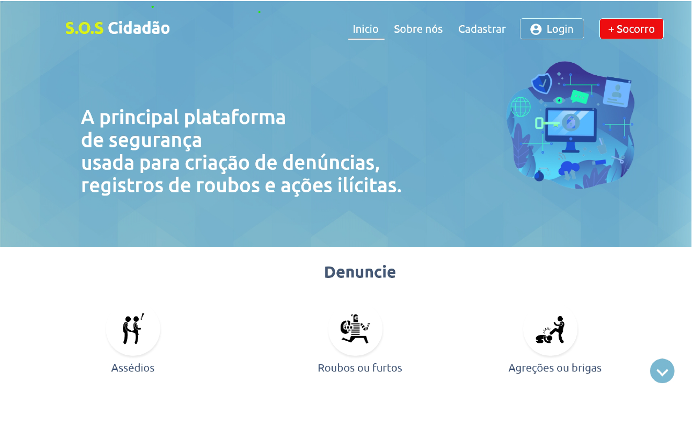
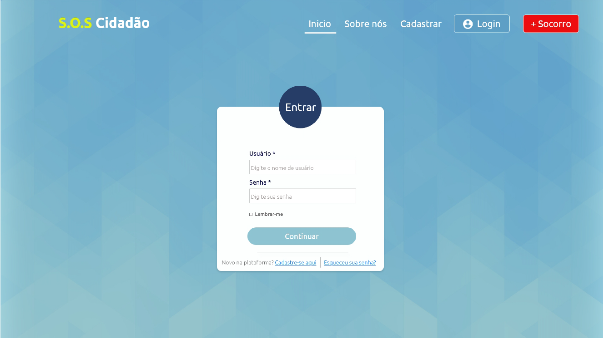
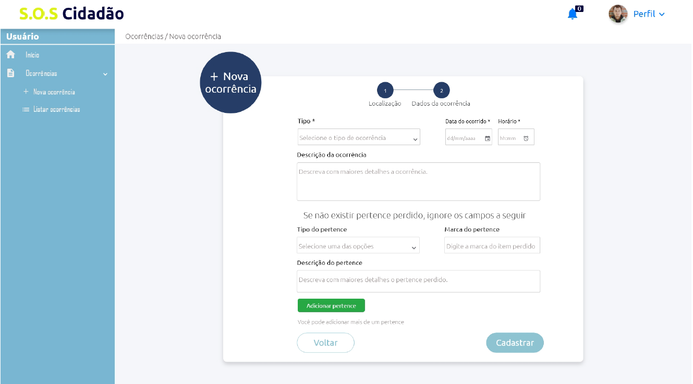
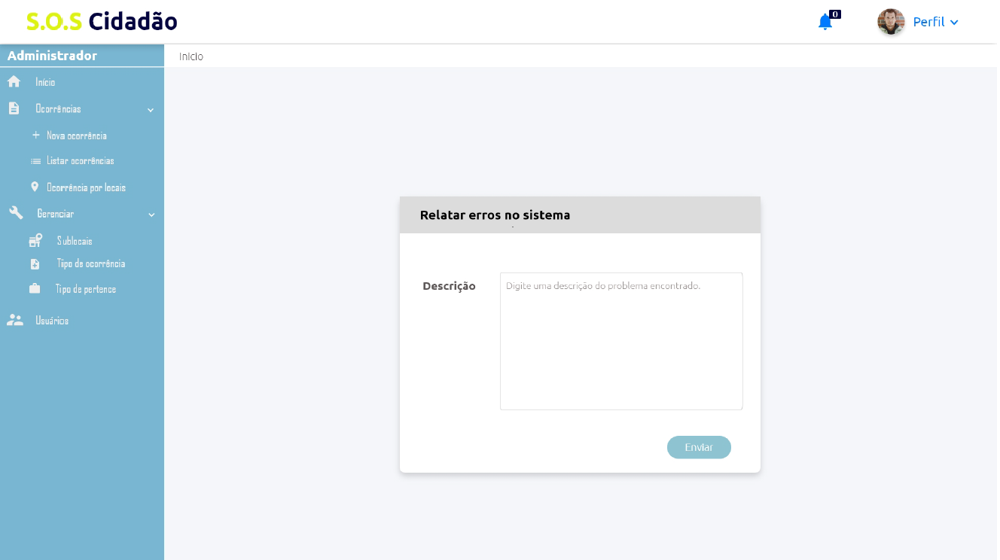

 
<h1 align=center> :beginner: S.O.S Cidadão - A sua plataforma de segurança. </h1>

   

<h3 align=center> Navegação </h1>

 <a href="#objetivo"> :heavy_check_mark: O que temos a oferecer? </a> |
 <a href="#solucao"> :chart_with_upwards_trend: Nossa solução </a>    
 <a href="#usuarios"> :raising_hand_man: Usuários</a> |
 <a href="#agentes"> :policeman: Agentes</a> |
 <a href="#gestores"> 	:office: Gestores</a>    
 <a href="#autor"> 	:copyright: Autores</a>

   

<h2 align=center id="objetivo"> O que temos a oferecer? </h2>

- Acesse de qualquer dipositivo: celulares, notebooks e tablets
- Registre ocorrências de forma fácil, rápida, com precisão e maior acessibilidade. 
- Acompanhe a evolução de uma ocorrência, anexos, comentários e pertences recuperados/perdidos

- Alerta de emergência para casos onde o tempo é um fator muito importante. Um minuto pode salvar vidas!
- Controle e atendimento de ocorrências abertas de forma automatizada

- Gerencie a segurança de uma organização presente na plataforma
- Obtenha métricas e haja de forma preventiva na sua organização

- **Mantenha o nivel de segurança o mais alto possivel!** 

   

<h2 align=center id="solucao"> Um pouco sobre a nossa solução </h2>

Sistema para registro e acompanhamento de ocorrências relacionados à segurança ou ações ilicitas, como também situações de emergências. Trazendo consigo uma maior acessibildidade, em relação aos meios tradicionais para registrar uma ocorrência, e controle das informações sobre os casos cadastrados na plataforma, possibilitando melhor gerenciamento do adanamento da suas aberturas de ocorrências, bem como permitir gerênciar, quantificar e realizar o controle das mesmas.

   

   

   

<h2 id="usuarios">  :raising_hand_man: Usuários</h2>
Os usuários podem realizar ações sem que precisem estar autenticados, como solicitar um emergência. Por outro lado, estando autenticado é possivel ter o gerenciamento de suas ocorrências registradas, acompanhar a sua evolução, pertences que foram encotrados e estão para serem entregues ao responsável, anexos de arquivos entre outras funcionalidades, a fim de propriciar informações necessárias para a solução do caso.

   

   

   

<h2 id="agentes"> :policeman: Agentes</h2>

Assim com é permitido uma pessoa que acessa o sistema realizar o registro de tais ocorrências, também, deve-se ter um outro ator que realiza o atendimento de tais solicitações, sendo eles profissionais capacitados para aquele tipo de situação, como agentes de segurança, vigilantes, bombeiros dentre outras especialidades disponíveis no sistema.
Com isso, é permitido o acompanhamento de ocorrências em tempo reais, desdes as mais recentes até as mais antigas, com os diversos graus de emergência, visando sempre otimizar o trabalho e permitir a acompanhmento destes de forma rápida, ágil e eficaz.

   

   

   

<h2 id="gestores">:office: Gestores</h2>
Aos gestores possuem funcionalidades capazes de auxiliar nas tomadas de decisões, preventivas e corretivas, com relação aos registros de ocorrências, permitindo saber quais pontos possuem maiores taxas de ocorrência, necessitam de novos agentes para reforçar uma determinada área. Além, de permitir gerenciar sub-locais dentro de uma instituição, como campus de universidades, clubes e eventos de grande porte.

   

   

    

<h2 id="autor" align=center>Colaboradores</h2>

- Dryele Alves (Desenvolvedora)
- Luiz Moitinho (Desenvolvedor)
- Roberto Santana Desenvolvedor)
- Wedson Teixeira (Desenvolvedor)
- Marcos Dósea (Tutor)

***
<h3  align=center>Universidade Federal de Sergipe</h3>
<h4  align=center>Campus Prof. Alberto Carvalho</h4>

